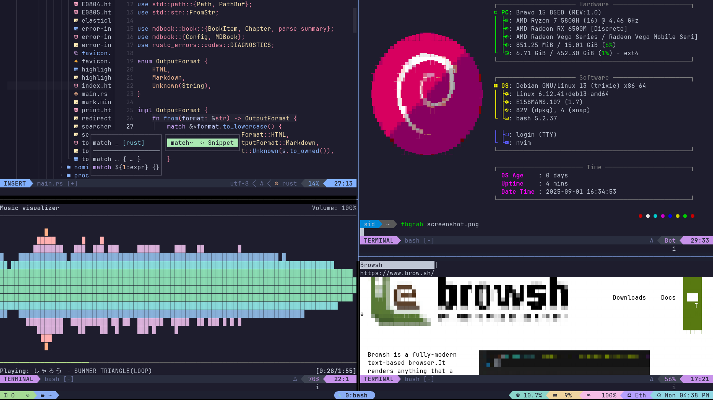

# My `setup.sh`



> [!IMPORTANT]
> Currently supports fresh standard installations of [Debian](https://www.debian.org/download) >= 13 or [Ubuntu Server](https://ubuntu.com/download/server) >= 24.04, as well as of [r0b0/debian-installer](https://github.com/r0b0/debian-installer) for which you need to either `apt autopurge tpm2-tools` or (if using the TPM) `apt install -t trixie-backports curl` beforehand (see their [#103](https://github.com/r0b0/debian-installer/issues/103))

Run one of the following commands as the user for whom you wish to perform the setup:
```
su -c "wget -qO- https://s.id/setup-sh | sh -s $USER" -
```
```
su -c "curl -fsSL https://s.id/setup-sh | sh -s $USER" -
```
The username will be taken as an argument and the script will run after switching to the root user, for which the root password will be asked.

If no root password is set but sudo is available, prefix the above command with `sudo`.

If there is only one user (besides root), `$USER` can be omitted from the command. The setup will be done for the first non-root user found.

Similarly, to update the install, just run the command with `update-sh` instead:
```
su -c "wget -qO- https://s.id/update-sh | sh -s $USER" -
```
```
su -c "curl -fsSL https://s.id/update-sh | sh -s $USER" -
```
